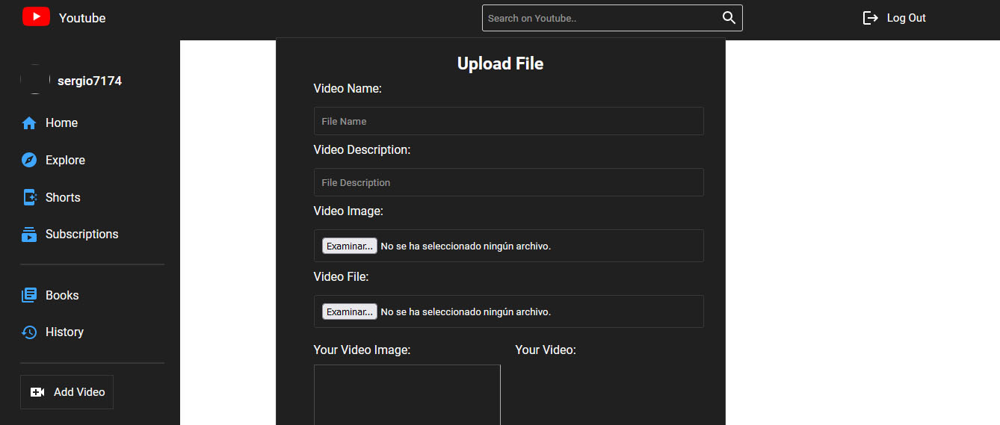

<h1 align ="center" > 🎥 MERN YouTube Clone Ser  </h1>
<h5  align ="center"> 
Fullstack open source Ecommerce application made with MongoDB, Express, React(JSX) & Nodejs (MERN) </h5>
<br>
<br>

  * [Configuration and Setup](#configuration-and-setup)
  * [Key Features](#key-features)
  * [Technologies used](#technologies-used)
      - [Frontend](#frontend)
      - [Backend](#backend)
      - [Database](#database)
      - [API](#api)
  * [📸 Screenshots](#screenshots)
  * [Author](#author)
  * <br>
  * ## Configuration and Setup

In order to run this project locally, simply fork and clone the repository or download as zip and unzip on your machine.

- Open the project in your prefered code editor.
- Go to terminal -> New terminal (If you are using VS code)
- Split your terminal into two (run the client on one terminal and the server on the other terminal)

In the first terminal

```
$ cd client
$ npm install (to install client-side dependencies)
$ npm run  start (to start the client) or npm start
```

In the second terminal

- cd server and Set environment variables in .env
- Create your mongoDB connection url, which you'll use as your MONGO_URL
- Supply the following credentials

```
#  --- .env  ---
PORT=5000
MONGO_URL="mongodb://0.0.0.0:27017/youtube02" --> Your Database name

NODE_ENV=development

JWT_SECRET_KEY="sergio" 
JWT_EXPIRE=10m

JWT_COOKIE=10
```

```
# --- Terminal ---

$ npm install (to install server-side dependencies)
$ npm start (to start the server) or with nodemon: nodemon server
--- DONT FORGET TO CREATE IMAGES DIRECTORY TO SAVE MULTER IMAGES AND VIDEOS --- PUBLIC/IMAGES - PUBLIC/VIDEOS
```


## ✔️ Tecnologias Utilizadas:


##  Screenshots:
<br>


<br>

##  Key Features:

- User registration and login
- Authentication using JWT Tokens
- Add, edit, delete Videos
- 404 Page and many more
- Responsive Design
<br/>

##  Technologies used

This project was created using the following technologies.

####  Frontend 

- [React js ](https://www.npmjs.com/package/react) - JavaScript library that is used for building user interfaces specifically for single-page applications
- [React Hooks  ](https://reactjs.org/docs/hooks-intro.html) - For managing and centralizing application state
- [react-router-dom](https://www.npmjs.com/package/react-router-dom) - To handle routing
- [axios](https://www.npmjs.com/package/axios) - For making Api calls
- [React-bootstrap](https://mui.com/) - For User Interface
- [React Redux](https://react-redux.js.org/) - manage application state efficiently and provide a more structured mechanism for managing data
- [React Toastify](https://www.npmjs.com/package/react-toastify) - To display interactive and responsive notifications (toasts) in web applications

####  Backend 

- [Node js](https://nodejs.org/en/) -A runtime environment to help build fast server applications using JS
- [Express js](https://www.npmjs.com/package/express) -The server for handling and routing HTTP requests
- [Mongoose](https://mongoosejs.com/) - For modeling and mapping MongoDB data to JavaScript
- [axios](https://www.npmjs.com/package/axios) - For making Api calls
- [jsonwebtoken](https://www.npmjs.com/package/jsonwebtoken) - For authentication
- [cookie-parser](https://www.npmjs.com/package/cookie-parser) - Middleware module used in Node.js web applications to manage cookies
- [cors](https://www.npmjs.com/package/cors) - Provides a Connect/Express middleware
- [Dotenv](https://www.npmjs.com/package/dotenv) - Zero Dependency module that loads environment variables
- [express-validator](https://www.npmjs.com/package/express-validator) - Used in Node.js applications with the Express framework to validate data submitted by users (user input)
- [nodemon](https://nodemon.io/) - Development utility for Node.js applications. Node.js is a runtime platform that allows you to run JavaScript on the server side.t
- [Multer] - Handle Images

####  Database 

 - [MongoDB ](https://www.mongodb.com/) - It provides a free cloud service to store MongoDB collections.

## Author
- Portfolio: 
- Github: 
- Sponsor: 
- Linkedin:https://www.linkedin.com/in/sergio-moncada-72589883/
- Email: [sergiogmoncada@yahoo.com](mailto:sergiogmoncada@yahoo.com)

